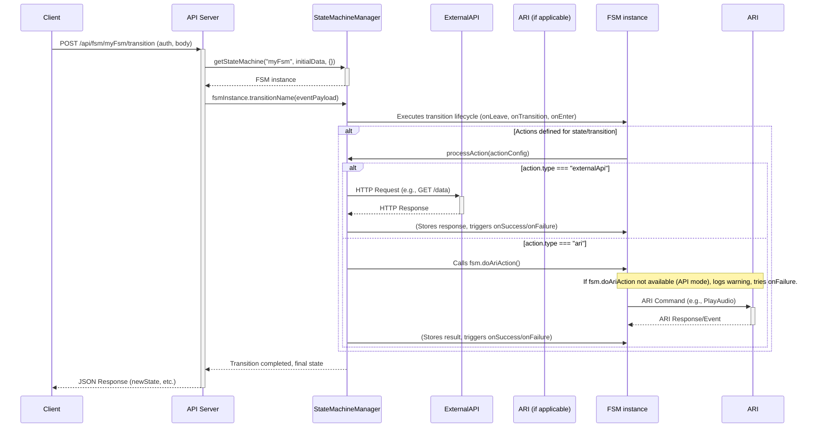

# API Documentation

This document provides details on the available API endpoints for interacting with the Finite State Machine (FSM) service.

## Authentication

All API endpoints require Bearer Token authentication. The token must be provided in the `Authorization` header.

*   **Header:** `Authorization: Bearer <your_api_token>`
*   The API token is configured in the `.env` file via the `API_TOKEN` variable. Ensure this token is kept secret and is strong.

## General Notes

*   **Content-Type:** For POST requests with a JSON body, ensure the `Content-Type` header is set to `application/json`.
*   **CSRF Token:** For API endpoints that modify data (POST, PUT, DELETE), if you are calling them from a web browser context that previously interacted with the web UI and has a CSRF cookie, you might also need to include an `X-CSRF-Token` header. This is generally handled automatically by requests originating from the application's web UI. For external API clients, Bearer token authentication is the primary security mechanism.

## Endpoints

### FSM Execution

#### 1. Transition State in an FSM
*   **POST** `/api/fsm/:machineId/transition`
*   **Description:** Executes a named transition on the specified FSM instance. This is the primary way to drive an FSM through its lifecycle. If the transition or the entry/exit of involved states have defined actions (External API calls, ARI operations), they will be executed. The endpoint awaits the completion of these actions before responding.
*   **URL Parameters:**
    *   `machineId` (string, required): The ID of the FSM (e.g., "myIvrFsm").
*   **Request Body (JSON):**
    ```json
    {
      "transitionName": "nextStep",
      "currentState": "currentStateName",
      "eventPayload": { "key": "value", "userInput": "123" },
      "initialData": { "customerTier": "gold", "callId": "uniqueCallId123" }
    }
    ```
    *   `transitionName` (string, required): The name of the transition to execute (must be defined in the FSM's `transitions` array).
    *   `currentState` (string, required): The current state of the FSM instance from which the transition should occur.
    *   `eventPayload` (object, optional): Arbitrary data relevant to the event causing the transition. This data is accessible to actions via the `{{payload.key}}` placeholder.
    *   `initialData` (object, optional): Data to initialize the FSM instance with if it's being effectively "rehydrated" or started for this interaction. This data becomes part of `fsmInstance.data` and is accessible via `{{fsm.key}}` placeholders in actions. If the FSM instance is already active (e.g., an ARI call), this might be less relevant than `eventPayload`.
*   **Success Response (200 OK):**
    ```json
    {
      "machineId": "myIvrFsm",
      "newState": "nextStateName",
      "possibleTransitions": ["anotherTransition", "endCall"],
      "message": "Transition \"nextStep\" successful."
    }
    ```
*   **Error Responses:**
    *   `400 Bad Request`: Missing required fields (e.g., `transitionName`, `currentState`), or the requested transition is not possible from the `currentState`.
    *   `401 Unauthorized`: Authentication token is null or missing.
    *   `403 Forbidden`: Authentication token is invalid.
    *   `404 Not Found`: The FSM definition for `machineId` was not found.
    *   `500 Internal Server Error`: General server-side errors, including issues within FSM lifecycle methods or action processing not related to external service failures. For example, if an ARI action is attempted but `fsm.doAriAction` is not available (e.g. in a non-ARI context).
    *   `502 Bad Gateway`: If an `externalApi` action fails due to an issue with the external service itself (e.g., network error, external server error).

*   **Action Execution Notes for `/transition`:**
    *   **Declarative Actions:** The system uses declarative actions defined in the FSM JSON. Refer to `FSM_DEFINITIONS.md` for how to structure `onEntry`, `onExit` (for states) and `action`/`actions` (for transitions).
    *   **ARI Actions in API-only Mode:** If an FSM fetched via this API endpoint (i.e., not within an active ARI call managed by `ariService.js`) attempts an ARI action, `stateMachineManager.js` will log a warning because `fsm.doAriAction` will not be available. If the ARI action has an `onFailure` transition defined, that transition will be attempted.

### FSM Definitions & Visualization

#### 2. List Available FSMs
*   **GET** `/api/fsm`
*   **Description:** Retrieves a list of IDs for all available FSM definitions.
*   **Success Response (200 OK):**
    ```json
    {
      "availableFsms": ["myIvrFsm", "outboundCampaignFsm"]
    }
    ```

#### 3. Get FSM Definition
*   **GET** `/api/fsm/:machineId/definition`
*   **Description:** Retrieves the complete JSON definition for a specific FSM.
*   **URL Parameters:**
    *   `machineId` (string, required): The ID of the FSM.
*   **Success Response (200 OK):**
    *   The raw JSON object of the FSM definition.
*   **Error Responses:**
    *   `404 Not Found`: FSM definition not found.

#### 4. Get FSM DOT Representation
*   **GET** `/api/fsm/:machineId/dot`
*   **Description:** Retrieves a string representation of the FSM in DOT format, suitable for graph visualization tools like Graphviz.
*   **URL Parameters:**
    *   `machineId` (string, required): The ID of the FSM.
*   **Success Response (200 OK):**
    *   Content-Type: `text/vnd.graphviz`
    *   The DOT string.
*   **Error Responses:**
    *   `404 Not Found`: FSM definition not found.
    *   `500 Internal Server Error`: Error generating DOT string.


### FSM Definition Management (Primarily for Web UI support)

These endpoints are primarily used by the web interface for managing FSM definitions but can be used by other clients.

#### 5. Save Graphical FSM Definition
*   **POST** `/api/fsm/:machineId/save_graphical_definition`
*   **Description:** Saves a complete FSM definition (JSON). This is typically used by the graphical editor.
*   **URL Parameters:**
    *   `machineId` (string, required): The ID of the FSM to save.
*   **Request Body (JSON):**
    *   The complete FSM definition object. The `id` property within the JSON body must match `machineId`.
*   **Success Response (200 OK):**
    ```json
    { "message": "FSM \"machineId\" saved successfully from graphical editor." }
    ```
*   **Error Responses:**
    *   `400 Bad Request`: Invalid payload or mismatch between `machineId` in URL and `id` in body.
    *   `500 Internal Server Error`: Error saving the definition.

#### 6. Add State to FSM
*   **POST** `/api/fsm/:machineId/state`
*   **Description:** Adds a new state definition to an FSM. (Note: In the current graphical editor, states are added client-side and saved with the whole definition. This endpoint is more for direct manipulation or the text-based editor).
*   **URL Parameters:**
    *   `machineId` (string, required).
*   **Request Body (JSON):**
    ```json
    { "name": "newStateName" }
    ```
*   **Success Response (200 OK):**
    ```json
    {
      "message": "State 'newStateName' added.",
      "currentDefinition": { ...updated FSM JSON... }
    }
    ```

#### 7. Add Transition Definition to FSM
*   **POST** `/api/fsm/:machineId/transition_def`
*   **Description:** Adds a new transition definition to an FSM. (Similar note as Add State regarding graphical editor usage).
*   **URL Parameters:**
    *   `machineId` (string, required).
*   **Request Body (JSON):**
    ```json
    {
      "name": "newTransitionName",
      "from": "sourceState",
      "to": "targetState"
    }
    ```
*   **Success Response (200 OK):**
    ```json
    {
      "message": "Transition 'newTransitionName' from 'sourceState' to 'targetState' added.",
      "currentDefinition": { ...updated FSM JSON... }
    }
    ```

#### 8. Set Initial State of FSM
*   **POST** `/api/fsm/:machineId/initial`
*   **Description:** Sets or changes the initial state of an FSM. (Similar note as Add State regarding graphical editor usage).
*   **URL Parameters:**
    *   `machineId` (string, required).
*   **Request Body (JSON):**
    ```json
    { "initial": "newInitialStateName" }
    ```
*   **Success Response (200 OK):**
    ```json
    {
      "message": "Initial state set to 'newInitialStateName'.",
      "currentDefinition": { ...updated FSM JSON... }
    }
    ```

## Examples

### Example: Triggering a transition that involves an action

Consider an FSM `order_processing` in state `awaiting_payment`. We want to trigger the `paymentReceived` transition.

```bash
curl -X POST \
  http://localhost:3000/api/fsm/order_processing/transition \
  -H 'Content-Type: application/json' \
  -H 'Authorization: Bearer your_api_token_here' \
  -d '{
    "transitionName": "paymentReceived",
    "currentState": "awaiting_payment",
    "eventPayload": {
      "paymentId": "txn_12345",
      "amount": 42.99
    }
  }'
```

If the `paymentReceived` transition (or the entry into the next state, e.g., `processing_order`) has an `externalApi` action to validate the payment, the API will wait for that action to complete. If the action has an `onSuccess` transition to `order_confirmed` or an `onFailure` to `payment_failed`, the `newState` in the response will reflect the outcome of that entire sequence.

Refer to `docs/FSM_DEFINITIONS.md` for details on how to define actions within your FSM JSON.

## API Interaction Sequence (Mermaid Diagram)


