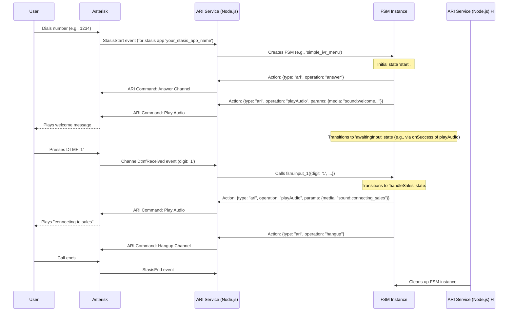

# Asterisk ARI Integration Guide

This document explains how the application integrates with an Asterisk PBX using the Asterisk REST Interface (ARI) to control call flows with Finite State Machines (FSMs).

## Introduction

The application can connect to Asterisk and listen for incoming calls. When a call is received into a designated Stasis application, this service can instantiate an FSM to manage the call's lifecycle, play audio, gather DTMF input, make external API calls, and execute other operations.

## Asterisk Configuration

1.  **Enable ARI:** Ensure ARI is enabled and configured in Asterisk (typically in `ari.conf`). You'll need to define an ARI user and password with appropriate permissions.
2.  **HTTP Access:** The Node.js application needs network access to Asterisk's ARI HTTP interface (default port 8088).

## Application Configuration (`.env` file)

Set the following environment variables in your project's `.env` file to configure the ARI connection:

*   `DISABLE_ARI="false"`: Set to `"true"` to prevent the application from attempting to connect to ARI.
*   `ASTERISK_ARI_URL="http://your_asterisk_ip:8088"`: The base URL for the Asterisk ARI. (The `/ari` path is often appended by the client library, so check your `ari-client` setup if issues arise).
*   `ASTERISK_ARI_USERNAME="your_ari_user"`: The username for ARI authentication.
*   `ASTERISK_ARI_PASSWORD="your_ari_password"`: The password for ARI authentication.
*   `ASTERISK_ARI_APP_NAME="your_stasis_app_name"`: The name of the Stasis application you will register with Asterisk. This exact name must be used in your Asterisk dialplan.

## Asterisk Dialplan Setup

To route calls from Asterisk to this application, use the `Stasis` dialplan application.

**Example `extensions.conf` entry:**
```dialplan
[your-incoming-context]
exten => 1234,1,NoOp(Incoming call for Stasis application)
  same => n,Stasis(${ASTERISK_ARI_APP_NAME}) ; Asterisk will pass control to your app
  same => n,Hangup()

; Example for passing arguments (e.g., a specific FSM ID)
exten => 1235,1,NoOp(Incoming call for Stasis application with FSM ID)
  same => n,Stasis(${ASTERISK_ARI_APP_NAME},my_specific_fsm) ; Passes 'my_specific_fsm' as an argument
  same => n,Hangup()
```
*   Replace `your-incoming-context` and `1234`/`1235` with your desired context and extension.
*   The argument passed to `Stasis()` after the application name (e.g., `my_specific_fsm`) can be used for dynamically determining which FSM definition to use (see "FSM ID Determination" below).

## Call Handling Flow

1.  **Connection:** `ariService.js` uses the `.env` variables to connect to Asterisk ARI and registers the specified `ASTERISK_ARI_APP_NAME`.
2.  **`StasisStart` Event:** When a call enters the Stasis application via your dialplan, Asterisk sends a `StasisStart` event to `ariService.js`.
3.  **`stasisStartHandler`:** This function in `ariService.js` handles the `StasisStart` event:
    *   **FSM ID Determination:** It determines which FSM definition to use. Currently, it defaults to `DEFAULT_ARI_FSM_ID` defined in `ariService.js`. (See `TODO` in the code for future dynamic determination based on event arguments or channel variables).
    *   **FSM Instantiation:** It retrieves the FSM definition using `stateMachineManager.getStateMachine()`.
    *   **`doAriActionOnFsm` Injection:** Crucially, it passes the `doAriActionOnFsm` function (from `ariService.js`) to the `stateMachineManager`. This function is then bound to the FSM instance as `fsm.doAriAction`, allowing the FSM to execute ARI commands within its own context.
    *   **Initial Data:** Information like `channelId`, `callerId`, and dialplan details are passed as `initialData` to the FSM.
    *   **Active FSM Tracking:** The new FSM instance is stored in `activeChannelFsms`, mapping the channel ID to its controlling FSM.
    *   **Initial Transition:** It may attempt to trigger an initial transition (e.g., `startCall` or `initiate`) on the newly created FSM.
4.  **DTMF Handling:** `stasisStartHandler` also attaches a `ChannelDtmfReceived` listener to the channel, routing DTMF events to `dtmfReceivedHandler`.
5.  **`StasisEnd` Event:** When the call ends, `stasisEndHandler` cleans up by removing the FSM instance from `activeChannelFsms`.

## Executing ARI Actions in FSMs

FSMs control calls by defining `ari` type actions in their JSON definition. Refer to `docs/FSM_DEFINITIONS.md` for the complete structure of these actions.

*   **Defining an ARI Action:**
    ```json
    {
      "type": "ari",
      "operation": "playAudio",
      "parameters": { "media": "sound:hello-world", "channelId": "{{fsm.channelId}}" },
      "storeResultAs": "playbackInfo",
      "onSuccess": "proceedToNextStep",
      "onFailure": "handlePlaybackError"
    }
    ```
*   **`doAriActionOnFsm` Function:** This function (available as `this.doAriAction()` within FSM methods, or called internally by `stateMachineManager` for declarative actions) executes the operation.
    *   It uses the FSM instance's context (`this`) to access data like `this.channelId`.
    *   It performs placeholder replacement in `parameters` using `{{fsm.var}}`, `{{payload.var}}`, and `{{event.var}}`.
*   **Key Supported ARI Operations (via `doAriActionOnFsm`):**
    *   `answer`: Answers the channel.
        *   Params: None (uses `fsm.channelId`).
    *   `hangup`: Hangs up the channel.
        *   Params: None (uses `fsm.channelId`).
    *   `playAudio`: Plays audio.
        *   Params: `{ "media": "sound:your-file&sound:another-file" }` (media URIs).
        *   Returns: `{ "playbackId": "..." }`.
    *   `getVariable`: Gets a channel variable.
        *   Params: `{ "variable": "CALLERID(num)" }`.
        *   Returns: `{ "value": "..." }`. (Stored if `storeResultAs` is used).
    *   `setVariable`: Sets a channel variable.
        *   Params: `{ "variable": "MY_VAR", "value": "some_value" }`.
    *   `getData`: Plays a prompt. Actual DTMF collection is managed by the FSM reacting to DTMF events (see below).
        *   Params: `{ "media": "sound:enter-pin" }`.
        *   Returns: `{ "playbackId": "..." }`.
    *   `originateCall`: Originates a new call.
        *   Params: `{ "endpoint": "PJSIP/other_phone", "context": "default", "extension": "s", "callerId": "{{fsm.callerId}}" }`.
        *   Returns: `{ "channelId": "new_channel_id", "name": "...", "state": "..." }`.

## DTMF Handling

*   `dtmfReceivedHandler` in `ariService.js` is triggered when DTMF is detected on a channel.
*   It attempts to fire transitions on the FSM associated with that channel:
    1.  **Specific Digit Transition:** `input_X` (e.g., `input_1`, `input_#`, `input_*`).
    2.  **Generic DTMF Transition:** `handleDtmf` (if the specific digit transition is not found or cannot be executed).
    3.  **Invalid Input Transition:** `invalid_input` (if neither of the above are found/executable).
*   The FSM transition method receives a payload: `{ "digit": "X", "eventData": { ...original ARI DTMF event... } }`.
*   Your FSM definition should include these transitions in its `transitions` array to react to user input.

## Example Call Flow (Mermaid Diagram)

This diagram shows a simplified IVR flow:



By defining FSMs with these ARI actions, complex call flows and IVR systems can be built and managed effectively.
