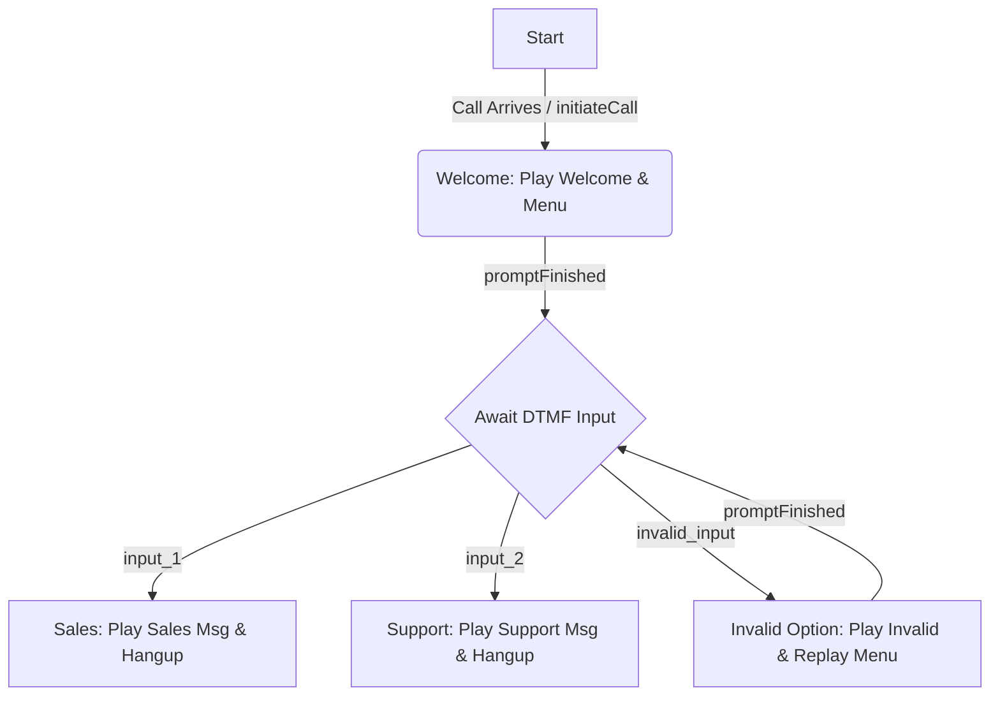

# FSM Definition Guide

This document describes the JSON structure used to define Finite State Machines (FSMs) for this application. These definitions are typically stored in `.json` files within the `fsm_definitions/` directory.

## Introduction

A state machine definition is a JSON object that specifies its identifier, initial state, all possible states, transitions between these states, and actions to be performed during state lifecycle events or transitions.

The application uses these definitions to create and manage FSM instances, which can control call flows (via ARI), interact with external APIs, or perform other automated tasks.

## Root Properties

The root of the FSM JSON object can contain the following properties:

*   `id` (string, required): A unique identifier for the state machine. This ID should match the filename (without the `.json` extension) when stored in the `fsm_definitions/` directory.
*   `initial` (string, required): The name of the state the FSM will be in when it's first created and started. This state name must be one of the keys in the `states` object.
*   `states` (object, required): Defines all possible states of the FSM. (See details below)
*   `transitions` (array of objects, required): Defines all possible transitions between states. (See details below)
*   `externalApis` (object, optional): A collection of named configurations for frequently used external API calls. Actions can refer to these by name. (See details below)
*   `methods` (object, optional): Custom JavaScript functions that can be invoked as lifecycle event handlers, typically for logic more complex than declarative actions. These execute *after* any declarative actions for the same event.

## `states` Object

The `states` object contains key-value pairs, where each key is the unique name of a state (string), and the value is an object configuring that state.

*   **Example:**
    ```json
    "states": {
      "idle": {
        "onEntry": [{ "type": "ari", "operation": "answer" }]
      },
      "playingMenu": {
        "onEntry": [
          {
            "type": "ari",
            "operation": "playAudio",
            "parameters": { "media": "sound:main_menu_prompt" },
            "onSuccess": "menuPlayed"
          }
        ],
        "onExit": [{ "type": "log", "message": "Exiting menu play state" }]
      },
      "final": {}
    }
    ```

*   **State Configuration Object:**
    *   `onEntry` (array of action objects, optional): An array of actions to be executed sequentially when the FSM enters this state.
    *   `onExit` (array of action objects, optional): An array of actions to be executed sequentially when the FSM exits this state.

## `transitions` Array

The `transitions` array defines all valid state changes. Each element in the array is a transition object.

*   **Transition Object Properties:**
    *   `name` (string, required): The name of the transition. This is used when programmatically triggering a transition (e.g., `fsm.doTransition('transitionName')`).
    *   `from` (string or array of strings, required): The name of the state (or an array of state names) from which this transition is allowed.
    *   `to` (string, required): The name of the state to which the FSM will move after this transition.
    *   `action` (action object, optional): A single action object to be executed during the transition. If `actions` is also present, `action` is typically executed before the `actions` array.
    *   `actions` (array of action objects, optional): An array of action objects to be executed sequentially during the transition.
    *   *(Note: The underlying `javascript-state-machine` library also supports a `if` property for conditional transitions, which could be a more advanced feature.)*

*   **Example:**
    ```json
    "transitions": [
      { "name": "startCall", "from": "idle", "to": "playingMenu" },
      { "name": "menuPlayed", "from": "playingMenu", "to": "waitForInput" },
      {
        "name": "input_1",
        "from": "waitForInput",
        "to": "salesQueue",
        "actions": [{ "type": "log", "message": "User pressed 1 for Sales" }]
      },
      { "name": "hangupCall", "from": "*", "to": "final" }
    ]
    ```
    *(Note: `from: "*"` means the transition can occur from any state.)*

## Action Object Structure

Actions define specific operations to be performed by the FSM. They are used in `onEntry`, `onExit` arrays within states, and in `action` or `actions` properties within transitions.

*   **Common Properties for all Action Objects:**
    *   `type` (string, required): Specifies the type of action. Currently supported: `"externalApi"` and `"ari"`. (A `"log"` type might be useful for simple debugging messages if implemented).
    *   `onSuccess` (string, optional): The name of an FSM transition to attempt if this action completes successfully. The transition must be defined in the main `transitions` array and be valid from the current state at the time of execution.
    *   `onFailure` (string, optional): The name of an FSM transition to attempt if this action fails.

### `externalApi` Action Details

Used for making HTTP/HTTPS calls to external services.

*   `type: "externalApi"`
*   `request` (object or string, required):
    *   If **object** (inline definition):
        *   `url` (string, required): The URL of the external API. Supports placeholder replacement.
        *   `method` (string, required): HTTP method (e.g., "GET", "POST", "PUT", "DELETE").
        *   `headers` (object, optional): Key-value pairs for HTTP headers. Values support placeholder replacement.
        *   `body` (object or string, optional): The request body for methods like POST or PUT. Supports placeholder replacement (if string or within string values of an object).
    *   If **string**: The name of a pre-defined API call configuration found in the top-level `externalApis` object of the FSM definition.
*   `storeResponseAs` (string, optional): If provided, the data returned from the API call (typically the response body) will be stored as a property on the FSM instance with this name (e.g., if `storeResponseAs: "userData"`, then `fsm.userData` will contain the response).

*   **Example `externalApi` Action:**
    ```json
    {
      "type": "externalApi",
      "request": {
        "url": "https://api.example.com/users/{{fsm.userId}}",
        "method": "GET",
        "headers": { "X-Auth-Token": "{{fsm.authToken}}" }
      },
      "storeResponseAs": "apiResult",
      "onSuccess": "userFetched",
      "onFailure": "apiFailed"
    }
    ```

### `ari` Action Details

Used for interacting with Asterisk via the Asterisk REST Interface (ARI).

*   `type: "ari"`
*   `operation` (string, required): The name of the ARI operation to perform. Supported operations include:
    *   `answer`: Answer the current channel.
    *   `hangup`: Hangup the current channel.
    *   `playAudio`: Play audio on the channel.
    *   `getVariable`: Get a channel variable.
    *   `setVariable`: Set a channel variable.
    *   `getData`: Play a prompt (for DTMF collection). Note: Actual DTMF collection is handled by FSM transitions reacting to DTMF events.
    *   `originateCall`: Originate a new call.
*   `parameters` (object, optional): Key-value pairs specific to the chosen `operation`. Values support placeholder replacement.
    *   Examples:
        *   For `playAudio`: `{ "media": "sound:your-prompt" }`
        *   For `getVariable`: `{ "variable": "CALLERID(num)" }`
        *   For `setVariable`: `{ "variable": "MY_VAR", "value": "test" }`
        *   For `originateCall`: `{ "endpoint": "PJSIP/101", "context": "default", "extension": "s" }`
        *   For most channel-specific operations, `channelId` can be omitted from parameters if `fsm.channelId` is set, as it will be used by default. It can be specified if operating on a different channel ID (e.g., a newly originated one).
*   `storeResultAs` (string, optional): If provided, the result of the ARI operation will be stored as a property on the FSM instance (e.g., for `getVariable`, `storeResultAs: "dialedNumber"` would make `fsm.dialedNumber` hold the value).

*   **Example `ari` Action:**
    ```json
    {
      "type": "ari",
      "operation": "playAudio",
      "parameters": {
        "media": "sound:welcome-message-{{fsm.language}}",
        "channelId": "{{fsm.mainChannelId}}"
      },
      "onSuccess": "playbackFinished"
    }
    ```

## Placeholder Usage

Placeholders allow dynamic data to be inserted into action configurations.

*   **Syntax:** `{{source.path.to.value}}`
    *   `source`: Can be `fsm`, `payload`, or `event`.
    *   `path.to.value`: A dot-separated path to the desired property. Arrays and nested objects are supported (e.g., `{{fsm.callData.attempts}}`, `{{payload.digits[0]}}`).
*   **Sources:**
    *   `fsm`: Refers to properties directly on the FSM instance (e.g., `fsm.channelId`, `fsm.userData` if stored by a previous action).
    *   `payload`: Refers to data passed when a transition is triggered (e.g., `fsm.doTransition('eventName', { someData: 'value' })` makes `{{payload.someData}}` available). This is the `eventPayload` argument in action processing.
    *   `event`: Refers to data from the lifecycle event object passed by `javascript-state-machine` (e.g., `lifecycle.from`, `lifecycle.to`). This is the `lifecycleEvent` argument in action processing.
*   **Applicable Fields:**
    *   External API actions: `request.url`, string values in `request.headers`, string values in `request.body` (if body is an object), or the entire `request.body` if it's a string.
    *   ARI actions: String values in the `parameters` object.

## Top-level `externalApis` Object (Optional)

This object can be defined at the root of the FSM JSON to pre-configure named external API calls.

*   **Structure:**
    ```json
    "externalApis": {
      "fetchUserDetails": {
        "url": "https://api.example.com/users/{{payload.id}}",
        "method": "GET",
        "headers": { "X-App-ID": "myFsmApp" },
        "timeout": 5000
      },
      "logEvent": {
        "url": "https://logger.example.com/events",
        "method": "POST"
      }
    }
    ```
*   **Usage:** An `externalApi` action can then refer to these by name:
    ```json
    {
      "type": "externalApi",
      "request": "fetchUserDetails", // Name matches key in externalApis
      "storeResponseAs": "userDetails",
      "onSuccess": "processUserDetails"
    }
    ```
    The `stateMachineManager` will look up "fetchUserDetails" in `fsm.externalApis` and use its configuration. Placeholders in the named config will be resolved against the current FSM instance and the payload passed to the action.

## Example FSM Definitions

### Simple FSM
```json
{
  "id": "simple_fsm",
  "initial": "pending",
  "states": {
    "pending": {},
    "active": {},
    "closed": {}
  },
  "transitions": [
    { "name": "activate", "from": "pending", "to": "active" },
    { "name": "close", "from": "active", "to": "closed" },
    { "name": "reset", "from": ["active", "closed"], "to": "pending" }
  ]
}
```

### FSM with External API Action
```json
{
  "id": "user_processing_fsm",
  "initial": "idle",
  "states": {
    "idle": {},
    "fetching": {
      "onEntry": [
        {
          "type": "externalApi",
          "request": {
            "url": "https://jsonplaceholder.typicode.com/todos/{{fsm.todoId}}",
            "method": "GET"
          },
          "storeResponseAs": "todoData",
          "onSuccess": "dataRetrieved",
          "onFailure": "fetchFailed"
        }
      ]
    },
    "completed": {},
    "error": {}
  },
  "transitions": [
    { "name": "fetchTodo", "from": "idle", "to": "fetching" },
    { "name": "dataRetrieved", "from": "fetching", "to": "completed" },
    { "name": "fetchFailed", "from": "fetching", "to": "error" }
  ]
}
```

### FSM with ARI Actions (Simple IVR Menu)

```json
{
  "id": "simple_ivr_menu",
  "initial": "start",
  "states": {
    "start": {
      "onEntry": [
        { "type": "ari", "operation": "answer" },
        {
          "type": "ari",
          "operation": "playAudio",
          "parameters": { "media": "sound:ivr/welcome&sound:ivr/main_menu_options" },
          "onSuccess": "menuPromptFinished"
        }
      ]
    },
    "awaitingInput": {},
    "handleSales": {
      "onEntry": [
        { "type": "ari", "operation": "playAudio", "parameters": { "media": "sound:ivr/connecting_sales" } },
        { "type": "ari", "operation": "hangup" }
      ]
    },
    "handleSupport": {
      "onEntry": [
        { "type": "ari", "operation": "playAudio", "parameters": { "media": "sound:ivr/connecting_support" } },
        { "type": "ari", "operation": "hangup" }
      ]
    },
    "invalidInput": {
      "onEntry": [
        { "type": "ari", "operation": "playAudio", "parameters": { "media": "sound:ivr/invalid_option" } },
        {
          "type": "ari",
          "operation": "playAudio",
          "parameters": { "media": "sound:ivr/main_menu_options" },
          "onSuccess": "menuPromptFinished"
        }
      ]
    }
  },
  "transitions": [
    { "name": "initiateCall", "from": "none", "to": "start"},
    { "name": "menuPromptFinished", "from": "start", "to": "awaitingInput" },
    { "name": "menuPromptFinished", "from": "invalidInput", "to": "awaitingInput" },
    { "name": "input_1", "from": "awaitingInput", "to": "handleSales" },
    { "name": "input_2", "from": "awaitingInput", "to": "handleSupport" },
    { "name": "invalid_input", "from": "awaitingInput", "to": "invalidInput" }
  ]
}
```

## Mermaid Diagram Example

This diagram illustrates a simplified version of the IVR menu FSM:


